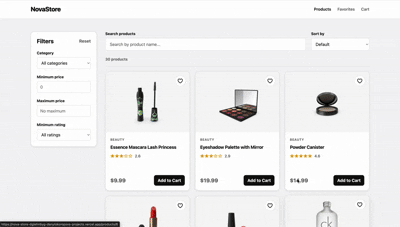

# NovaStore

NovaStore is a responsive e-commerce single-page application built with React. It covers the customer journey from product discovery and product details to a persistent cart, validated demo checkout, and order confirmation, using live catalog data from DummyJSON.

## Live Demo

[View NovaStore live](https://nova-store-dglehnbyg-danylokoropovs-projects.vercel.app/)

## Preview



## Features

- Product catalog loaded from the DummyJSON API
- Product search by title, category, or brand
- Category, minimum/maximum price, and minimum-rating filters
- Sorting by price, rating, and product name
- Product detail pages with image gallery, availability, discount, shipping, returns, warranty, and customer reviews
- Quantity selection with stock-aware limits
- Shopping cart with item quantities, removal, clearing, subtotals, and total item count
- Favorites collection with add/remove controls and a navigation counter
- Cart and favorites persistence through `localStorage`
- Three-step demo checkout for contact, shipping, and payment information
- Client-side form validation, input formatting, accessible error messages, and focus management
- Demo order confirmation with a generated order number
- Loading, API error, empty-result, empty-cart, empty-favorites, and 404 states
- Responsive layouts for catalog, product details, cart, and checkout

> Authentication, a backend, real payment processing, and order persistence are intentionally outside the current project scope. Checkout data is validated in the browser and is not submitted to a payment provider.

## Tech Stack

- React 19
- React Router 7
- React Context API
- JavaScript (ES modules and JSX)
- HTML5 and modular CSS
- Fetch API
- Web Storage API (`localStorage`)
- DummyJSON Products API
- Vite 8
- Oxlint

## Architecture

NovaStore uses a component-based SPA architecture. React Router maps the catalog, product details, favorites, cart, checkout, success, and fallback pages inside a shared layout. Domain components are grouped by feature, while pages coordinate data loading and user flows.

Catalog access is isolated in a small API module. Products and categories are fetched concurrently, with explicit loading and error states; search, filters, and sorting are composed on the client. Cart and favorites are maintained by separate Context providers, exposing focused actions and derived counts/totals while synchronizing their state with `localStorage`. Checkout validation and currency formatting are kept in standalone utilities.

## Folder Structure

```text
nova-store/
├── public/
│   ├── favicon.svg
│   └── icons.svg
├── src/
│   ├── api/
│   │   └── productsApi.js
│   ├── assets/
│   │   └── demoN.gif
│   ├── components/
│   │   ├── cart/
│   │   ├── checkout/
│   │   ├── layout/
│   │   └── products/
│   ├── context/
│   │   ├── CartContext.jsx
│   │   └── FavoritesContext.jsx
│   ├── pages/
│   ├── styles/
│   ├── utils/
│   ├── App.jsx
│   ├── index.css
│   └── main.jsx
├── index.html
├── package.json
└── vite.config.js
```

## Key Technical Challenges

- **Composable catalog controls:** search, category, price, and rating conditions are combined before applying a selectable sort without mutating the source API data.
- **Persistent global state:** cart and favorites use independent Context providers, recover safely from invalid stored JSON, and persist after every state change.
- **Inventory-aware cart behavior:** quantities are clamped between one and available stock both on product pages and in the cart.
- **Checkout UX:** controlled inputs format card and expiration values, validate the complete form, expose errors with ARIA attributes, and focus the first invalid field.
- **Async route data:** catalog and product-detail requests provide dedicated loading, error, and not-found paths.

## Performance Considerations

- Products and categories are requested concurrently with `Promise.all`.
- Catalog filtering and sorting reuse the initially fetched product collection and require no extra request per control change.
- Cart and favorite records store only the fields required by their views.
- Vite produces optimized, minified production assets.
- Responsive product grids reduce unnecessary layout density on smaller screens.

For a larger catalog, memoized derived results, debounced search, server-side filtering/pagination, image lazy loading, and route-level code splitting would be appropriate next optimizations.

## Installation

```bash
git clone https://github.com/DanyloKoropov/nova-store.git
cd nova-store
npm install
npm run dev
```

## Build

```bash
npm run build
npm run preview
```

Run the code quality check with:

```bash
npm run lint
```

## Future Improvements

- Add automated unit and user-flow tests
- Add server-side pagination and URL-synchronized catalog controls
- Add accessible mobile filter controls
- Add skeleton loading states and retry actions for failed requests
- Add route-level lazy loading and optimized responsive images
- Add authentication and a user account area
- Connect checkout to a backend and payment provider
- Add order history and inventory synchronization

## License

This project is licensed under the MIT License.
